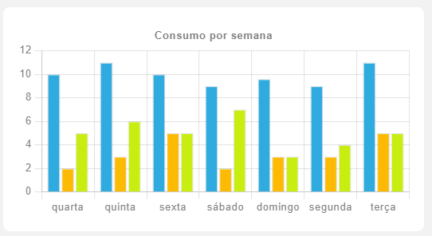
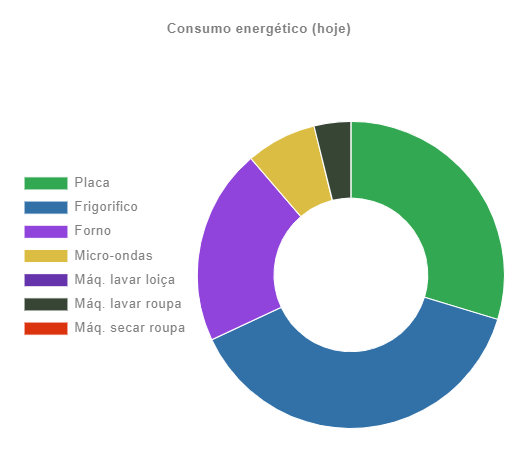

# chartjs-card

Chart.js card for Home Assistant

## [Chart.js 3.7.0 documentation](https://www.chartjs.org/docs/3.7.0/)


## Instalation through HACS

This card isn't in HACS, but you can add it manually through `Custom repositories`

To do that just follow these steps: **HACS -> Frontend -> 3 dots (upper right corner) -> Custom repositories -> (Paste this github page url)**

## Config

| Name           | Type    | Default | Description                                                        |
| -------------- | ------- | ------- | ------------------------------------------------------------------ |
| chart          | string  |         | chart type                                                         |
| data           |         |         | just like chart.js documentation, accepts Templates for all fields |
| options        |         |         | just like chart.js documentation                                   |
| plugins        |         |         | just like chart.js documentation                                   |
| entitiy_row    | boolean | false   | if is entity row or not                                            |
| custom_options | object  |         | TODO                                                               |

## Templating

Everything between Curly braces and started with a Dollar sign, will be evaluated as Javascript code

You can easily access states through:

```js
${states["sensor.example"].state}
```

or you can convert a Date to a week day label:

```js
${new Date(new Date().setDate(new Date().getDate()-2)).toLocaleString("pt-PT", {weekday: "short"})}
```

or more simple for today

```js
${new Date().toLocaleString("pt-PT", {weekday: "short"})}
```

and you can convert array string to a real array like so

```js
${'[12, 14, 2, 4]'}
```

can be useful when you grab a lot of data from the DB and want to display all in the graph

## Examples

### example 1


```yaml
chart: bar
data:
  datasets:
    - backgroundColor: ${states["sensor.chartjs_energy_last_30_days"].attributes.colors}
      borderWidth: 1
      data: ${states["sensor.chartjs_energy_last_30_days"].attributes.data}
      label: Eletricidade
  labels: ${states["sensor.chartjs_energy_last_30_days"].attributes.labels}
custom_options:
  showLegend: false
options:
  plugins:
    title:
      display: true
      text: Consumo energético (últimos 30 dias)
entity_row: false
type: custom:chartjs-card
```

### example 2



```yaml
type: custom:chartjs-card
chart: bar
custom_options:
  showLegend: false
data:
  datasets:
    - backgroundColor: '#2fabe0'
      borderWidth: 1
      data:
        - 10
        - 11
        - 10
        - 9
        - 9.6
        - 9
        - 11
      label: Lavar roupa
    - backgroundColor: '#fcba03'
      borderWidth: 1
      data:
        - 2
        - 3
        - 5
        - 2
        - 3
        - 3
        - 5
      label: Frigorífico
    - backgroundColor: '#c8ed11'
      borderWidth: 1
      data:
        - 5
        - 6
        - 5
        - 7
        - 3
        - 4
        - 5
      label: Placa
  labels:
    - >-
      ${new Date(new Date().setDate(new
      Date().getDate()-6)).toLocaleString("pt-PT", {weekday: "short"})}
    - >-
      ${new Date(new Date().setDate(new
      Date().getDate()-5)).toLocaleString("pt-PT", {weekday: "short"})}
    - >-
      ${new Date(new Date().setDate(new
      Date().getDate()-4)).toLocaleString("pt-PT", {weekday: "short"})}
    - >-
      ${new Date(new Date().setDate(new
      Date().getDate()-3)).toLocaleString("pt-PT", {weekday: "short"})}
    - >-
      ${new Date(new Date().setDate(new
      Date().getDate()-2)).toLocaleString("pt-PT", {weekday: "short"})}
    - >-
      ${new Date(new Date().setDate(new
      Date().getDate()-1)).toLocaleString("pt-PT", {weekday: "short"})}
    - '${new Date().toLocaleString("pt-PT", {weekday: "short"})}'
entity_row: false
options:
  scales:
    x:
      scaleLabel:
        display: true
        fontStyle: initial
        labelString: Dias
    'y':
      scaleLabel:
        display: true
        fontStyle: initial
        labelString: Horas
      ticks:
        beginAtZero: true
  plugins:
    title:
      display: true
      text: |
        Consumo por semana
```

### example 3



```yaml
chart: doughnut
custom_options:
  showLegend: true
data:
  datasets:
    - backgroundColor:
        - '#32a852'
        - '#3271a8'
        - '#9044db'
        - '#dbbd44'
        - '#6533ab'
        - '#364534'
        - '#db330d'
      borderColor: var(--paper-card-background-color)
      borderWidth: 1
      data:
        - ${states["sensor.energy_daily_placa"].state}
        - ${states["sensor.energy_daily_fridge"].state}
        - ${states["sensor.energy_daily_oven"].state}
        - ${states["sensor.energy_daily_microwave"].state}
        - ${states["sensor.energy_daily_dishwasher"].state}
        - ${states["sensor.energy_daily_washing_machine"].state}
        - ${states["sensor.energy_daily_drying_machine"].state}
      hoverBorderColor: var(--paper-card-background-color)
  labels:
    - Placa
    - Frigorifico
    - Forno
    - Micro-ondas
    - Máq. lavar loiça
    - Máq. lavar roupa
    - Máq. secar roupa
options:
  plugins:
    legend:
      position: left
    title:
      display: true
      text: Consumo energético (hoje)
type: custom:chartjs-card
```
